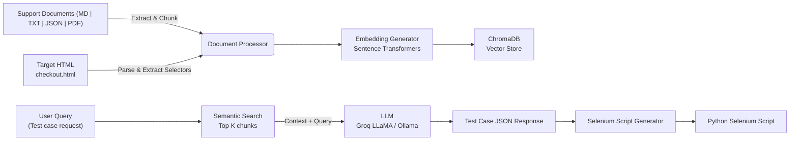

<h1 align="center">Autonomous QA Agent</h1>
<h3 align="center">AI-based Test Case Generator & Automated Selenium Script Builder</h3>

<p align="center">
  <b>FastAPI</b> • <b>Streamlit</b> • <b>ChromaDB</b> • <b> LLaMA/Ollama</b> • <b>RAG Pipeline</b>
</p>

---

##  Project Overview

The **Autonomous QA Agent** is an AI-powered platform that automatically generates:
- Comprehensive Positive & Negative Test Cases  
- Executable Selenium Automation Scripts  
- Traceability → Every test case is grounded in real documentation  
- Real HTML selectors → No hallucinated features  

This significantly reduces QA manual effort while improving accuracy and coverage.

---
## Deployment Links
- First run the backend: https://qa-agent-backend-s7bb.onrender.com
- Then Frontend part: https://qa-agent-frontend-s7bb.onrender.com/

## Key Features

- Upload support documents (MD, TXT, JSON, PDF, HTML)
- RAG-based test case generation using semantic search
- Vector knowledge base powered by ChromaDB
- Convert test cases → Selenium scripts automatically
- Grounded output linked to original requirement sources
- Clean Streamlit UI + FastAPI backend
- Local execution, secure & offline capable

---

## Architecture


## Tech Stack
- Layer	Technology
- Backend API:	FastAPI
- Frontend UI:	Streamlit
- Semantic Search:	ChromaDB
- LLM:	Groq LLaMA / Ollama
- Document Processing	Unstructured, BeautifulSoup4, PyMuPDF
- Automation Engine	Selenium WebDriver

---

## Installation & Setup

#### Clone repository
``` bash
git clone <repository-url>
cd autonomous-qa-agent
```
#### Install dependencies
```
pip install -r requirements.txt
```

#### Start backend API
```
python backend/main.py
```

#### Start UI
```
python -m streamlit run streamlit-app/app.py
```

## How To Use
- Upload Documents → Specs, UI guides, rules, API docs
- Upload HTML → Page under test
- Build Knowledge Base → Chunks + embeddings indexed
- Generate Test Cases → Structured + traceable
- Generate Selenium Script → Ready to execute 

## Sample Test Case Output
```
{
  "test_id": "TC-001",
  "feature": "Discount Code",
  "description": "Apply valid discount code SAVE15",
  "steps": [
    "Add product to cart",
    "Enter 'SAVE15' discount code",
    "Click Apply Discount"
  ],
  "expected_result": "15% discount should apply",
  "grounded_in": ["product_specs.md", "validation_rules.md"]
}
```
## Generated Selenium Script Example
```
driver.find_element(By.ID, "add-product-1").click()
driver.find_element(By.ID, "discount-code").send_keys("SAVE15")
driver.find_element(By.ID, "apply-discount").click()
assert "15%" in success_message.text
```
## Screenshots


## Project Structure
```
autonomous-qa-agent/
│── backend/
│   ├── main.py
│   ├── rag_engine.py
│   ├── document_processor.py
│   ├── script_generator.py
│── frontend/
│   ├── streamlit_app.py
│── documents/
│── html/
│── models/
│── utils/
│── README.md
│── requirements.txt
```

## Why It Matters
Problem in Manual QA	Our Solution
Slow test writing	AI generates instantly
Missing requirement coverage	Grounded tests ensure traceability
Fragile selectors	HTML-based selector extraction
Hard to scale	Any number of docs and pages supported

## Demo Video
https://drive.google.com/file/d/1WKcayHGSo-nSmSMuRwSsgmtvhkzRGFx_/view?usp=drive_link
Includes full flow from documents → test cases → scripts

## Roadmap
- Multi-page application flow testing

- Export to Playwright / Cypress

- Real-time browser agent execution

- CI/CD auto-test pipeline integration
